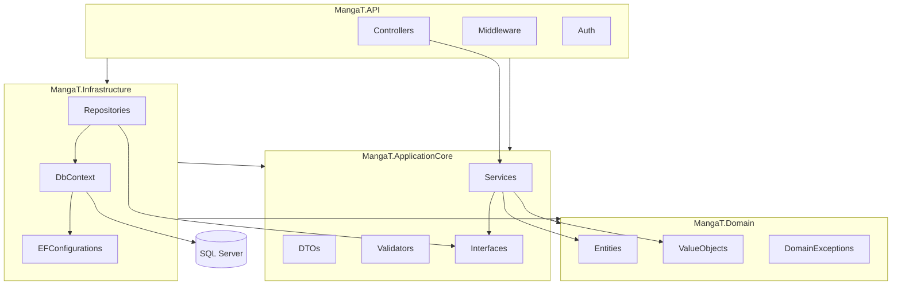

# Arquitectura

## Diagrama de capas



## Flujo de una petición GET /api/v1/manga/popular

1. `MangaController` recibe la petición HTTP.
2. El controller delega en `IMangaService` (no conoce EF ni SQL).
3. `MangaService` llama a `IMangaRepository`.
4. `MangaRepository` consulta `MangaDbContext`.
5. Los datos se mapean de `Manga` (dominio) a `MangaDto` (contrato API).
6. Se devuelve un `PagedResult<MangaDto>` con metadatos de paginación.

## Responsabilidad de cada capa

### MangaT.Domain
- Lógica de negocio pura.
- Sin referencias a EF, HTTP ni DI.
- Ejemplo: `Manga.Create()` valida invariantes; `Rating` valida rango 0-10.

### MangaT.ApplicationCore
- Orquesta casos de uso.
- Define contratos (`IMangaRepository`, `IMangaService`).
- Valida entrada con FluentValidation.
- Traduce entre dominio y DTOs.

### MangaT.Infrastructure
- Implementa persistencia con EF Core.
- Única capa que conoce SQL Server.
- Configura entidades con `IEntityTypeConfiguration`.

### MangaT.API
- Punto de entrada HTTP.
- Configura JWT, Swagger, health checks y middleware.
- No contiene lógica de negocio.

## Seguridad

| Concepto | Implementación |
|----------|----------------|
| Autenticación | JWT Bearer en `POST /api/v1/auth/login` |
| Autorización | `[Authorize(Roles = "Admin")]` en escritura |
| Lectura pública | `[AllowAnonymous]` en GET |

**Autenticación**: verifica identidad (¿quién eres?).
**Autorización**: verifica permisos (¿qué puedes hacer?).

## Manejo de errores (RFC 9457 Problem Details)

Usamos el estándar internacional **RFC 9457** (evolución de RFC 7807) con soporte nativo de ASP.NET Core:

- `AddProblemDetails()` — formato estándar de error
- `IExceptionHandler` — manejo global centralizado (recomendado desde .NET 8)
- Excepción controlada única `AppException` con factory methods (`NotFound`, `Validation`, `Business`)
- Excepciones de dominio mapeadas automáticamente (`DomainException` → 400)

Ejemplo de respuesta 404:

```json
{
  "type": "https://httpstatuses.com/404",
  "title": "Recurso no encontrado",
  "status": 404,
  "detail": "No se encontró el manga con id 99.",
  "instance": "/api/v1/manga/99",
  "errorCode": "NOT_FOUND",
  "traceId": "00-..."
}
```

Los controllers no construyen errores manualmente; lanzan o dejan propagar excepciones y el `GlobalExceptionHandler` las convierte a Problem Details.

## Regla de dependencias

Las dependencias apuntan **hacia adentro**:

```
API → Application → Domain
API → Infrastructure → Application → Domain
```

`Domain` no depende de ningún otro proyecto.
