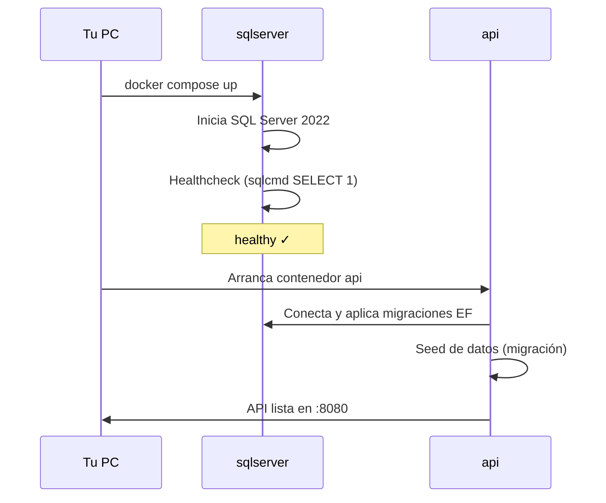

# Manual Docker — MangaT API

Guía paso a paso para levantar, probar y configurar el proyecto con Docker.

---

## Índice

1. [Requisitos previos](#1-requisitos-previos)
2. [Primera instalación](#2-primera-instalación)
3. [Levantar el proyecto](#3-levantar-el-proyecto)
4. [Verificar que todo funciona](#4-verificar-que-todo-funciona)
5. [Probar la API (pruebas manuales)](#5-probar-la-api-pruebas-manuales)
6. [Configuración personalizada](#6-configuración-personalizada)
7. [Escenarios de uso](#7-escenarios-de-uso)
8. [Comandos de referencia](#8-comandos-de-referencia)
9. [Solución de problemas](#9-solución-de-problemas)
10. [Arquitectura de contenedores](#10-arquitectura-de-contenedores)

---

## 1. Requisitos previos

### Software obligatorio

| Software | Versión mínima | Descarga |
|----------|----------------|----------|
| Docker Desktop | 4.x+ | https://www.docker.com/products/docker-desktop/ |

### Windows — configuración recomendada

1. Instala **Docker Desktop** y reinicia si te lo pide.
2. Abre Docker Desktop y espera a que diga **"Docker Desktop is running"**.
3. En *Settings → General*, activa **"Use the WSL 2 based engine"** (recomendado).
4. Verifica en terminal:

```powershell
docker --version
docker compose version
```

Salida esperada (ejemplo):

```
Docker version 27.x.x
Docker Compose version v2.x.x
```

### Recursos mínimos

- **RAM:** 4 GB libres (SQL Server consume ~2 GB)
- **Disco:** ~5 GB para imágenes Docker

---

## 2. Primera instalación

### Paso 1 — Clonar o abrir el repositorio

```powershell
cd C:\Practicas\manga_test_api
```

### Paso 2 — Crear archivo de configuración (opcional pero recomendado)

```powershell
Copy-Item .env.example .env
```

El archivo `.env` permite cambiar puertos, contraseñas y JWT sin editar `docker-compose.yml`.
**No se sube a git.**

### Paso 3 — Revisar el archivo `.env`

Abre `.env` y confirma los valores. Por defecto:

| Variable | Valor por defecto | Descripción |
|----------|-------------------|-------------|
| `MSSQL_SA_PASSWORD` | `MangaT_Str0ng!Pass` | Contraseña SA de SQL Server |
| `API_PORT` | `8080` | Puerto de la API en tu PC |
| `SQLSERVER_PORT` | `1433` | Puerto de SQL Server en tu PC |
| `JWT_KEY` | (ver `.env.example`) | Clave para firmar tokens |
| `ASPNETCORE_ENVIRONMENT` | `Development` | Habilita Swagger UI, Scalar y OpenAPI |

> **Importante:** La contraseña de SQL Server debe cumplir la política de Microsoft: mínimo 8 caracteres, mayúsculas, minúsculas, números y símbolos.

---

## 3. Levantar el proyecto

### Opción A — Primer arranque (construye imágenes)

```powershell
docker compose up --build
```

La primera vez tarda varios minutos (descarga imágenes de .NET 10 y SQL Server).

### Opción B — Arranque en segundo plano

```powershell
docker compose up --build -d
```

### Qué ocurre al iniciar



1. **sqlserver** arranca y ejecuta healthcheck cada 10 s.
2. Cuando SQL está **healthy**, arranca **api**.
3. La API aplica migraciones (`MigrateAsync`) con reintentos.
4. Swagger UI, Scalar y OpenAPI 3.1 quedan disponibles si `ASPNETCORE_ENVIRONMENT=Development`.

### Salida esperada en consola

Busca líneas como:

```
mangat-sqlserver  | SQL Server is now ready for client connections
mangat-api        | Now listening on: http://[::]:8080
mangat-api        | Application started.
```

---

## 4. Verificar que todo funciona

### 4.1 Estado de contenedores

```powershell
docker compose ps
```

| NAME | STATUS | PORTS |
|------|--------|-------|
| mangat-sqlserver | Up (healthy) | 0.0.0.0:1433→1433 |
| mangat-api | Up | 0.0.0.0:8080→8080 |

### 4.2 Health check de la API

Abre en el navegador o ejecuta:

```powershell
curl http://localhost:8080/health
```

Respuesta esperada: `Healthy`

### 4.3 Swagger UI (documentación clásica)

Abre en el navegador:

```
http://localhost:8080/swagger
```

Interfaz estándar de la industria. Para probar endpoints protegidos:

1. Ejecuta `POST /api/v1/auth/login` con `admin` / `Admin123!`
2. Copia el `token` de la respuesta
3. Pulsa **Authorize** e ingresa: `Bearer <token>`

Documento JSON de Swagger:

```
http://localhost:8080/swagger/v1/swagger.json
```

### 4.4 Scalar UI (documentación moderna .NET 10)

Abre en el navegador:

```
http://localhost:8080/scalar/v1
```

Deberías ver la interfaz de Scalar con todos los endpoints. Para probar endpoints protegidos:

1. Ejecuta `POST /api/v1/auth/login` con `admin` / `Admin123!`
2. Copia el `token` de la respuesta
3. Pulsa **Authorize** e ingresa: `Bearer <token>`

Documento OpenAPI 3.1 en bruto:

```
http://localhost:8080/openapi/v1.json
```

### 4.5 Logs en tiempo real

```powershell
docker compose logs -f api
```

Para salir: `Ctrl + C`

---

## 5. Probar la API (pruebas manuales)

### Usuarios de demostración

| Usuario | Contraseña | Rol |
|---------|------------|-----|
| `admin` | `Admin123!` | Admin — puede crear/editar/eliminar |
| `reader` | `Reader123!` | Reader — solo lectura autenticada |

### Prueba 1 — Listar manga populares (sin auth)

```powershell
curl http://localhost:8080/api/v1/manga/popular?page=1&pageSize=5
```

Debe devolver JSON con `items`, `page`, `totalCount`, etc.

### Prueba 2 — Login y obtener token JWT

```powershell
curl -X POST http://localhost:8080/api/v1/auth/login `
  -H "Content-Type: application/json" `
  -d '{"username":"admin","password":"Admin123!"}'
```

Copia el valor de `token` de la respuesta.

### Prueba 3 — Crear manga (requiere Admin)

```powershell
curl -X POST http://localhost:8080/api/v1/manga `
  -H "Authorization: Bearer <TU_TOKEN>" `
  -H "Content-Type: application/json" `
  -d '{"title":"Demon Slayer","author":"Koyoharu Gotouge","point":9.3,"volumeCount":23,"category":"Action"}'
```

Respuesta esperada: **HTTP 201 Created**

### Prueba 4 — Error 404 (Problem Details)

```powershell
curl http://localhost:8080/api/v1/manga/9999
```

Respuesta esperada: JSON con `status: 404`, `errorCode: "NOT_FOUND"`.

### Prueba 5 — Desde Visual Studio / archivo .http

Usa `MangaT.API/MangaT.API.http` cambiando el host a:

```
@MangaT_HostAddress = http://localhost:8080
```

### Prueba 6 — Tests automatizados (fuera de Docker)

Los tests de integración usan base en memoria y **no requieren Docker**:

```powershell
dotnet test
```

---

## 6. Configuración personalizada

### Cambiar puerto de la API

En `.env`:

```env
API_PORT=5000
```

Reinicia:

```powershell
docker compose down
docker compose up -d
```

Accede en: `http://localhost:5000`

### Cambiar contraseña de SQL Server

1. Edita `MSSQL_SA_PASSWORD` en `.env`.
2. **Si ya existía el volumen**, bórralo para que SQL se reinicialice:

```powershell
docker compose down -v
docker compose up --build
```

> `-v` elimina el volumen `mangat-sqlserver-data` y todos los datos.

### Cambiar clave JWT

En `.env`:

```env
JWT_KEY=TuNuevaClaveSecretaDeAlMenos32Caracteres!
```

Reinicia solo la API:

```powershell
docker compose restart api
```

### Solo levantar SQL Server (desarrollo local con `dotnet run`)

Comenta o no uses el servicio `api` y levanta solo la BD:

```powershell
docker compose up sqlserver -d
```

Luego en `appsettings.Development.json` o User Secrets, usa:

```
Server=localhost,1433;Database=MangaTDb;User Id=sa;Password=MangaT_Str0ng!Pass;TrustServerCertificate=True;
```

Y ejecuta localmente:

```powershell
dotnet run --project MangaT.API
```

---

## 7. Escenarios de uso

### Desarrollo diario con Docker

```powershell
# Mañana: levantar
docker compose up -d

# Tras cambiar código C#
docker compose up --build -d api

# Noche: apagar (conserva datos)
docker compose down
```

### Reset completo de base de datos

```powershell
docker compose down -v
docker compose up --build
```

### Ver qué hay dentro del contenedor API

```powershell
docker exec -it mangat-api bash
```

### Conectar a SQL Server desde SSMS o Azure Data Studio

| Campo | Valor |
|-------|-------|
| Servidor | `localhost,1433` |
| Autenticación | SQL Server |
| Usuario | `sa` |
| Contraseña | La de tu `.env` (`MSSQL_SA_PASSWORD`) |
| Base de datos | `MangaTDb` |

---

## 8. Comandos de referencia

| Acción | Comando |
|--------|---------|
| Levantar todo | `docker compose up --build` |
| Levantar en background | `docker compose up --build -d` |
| Ver logs API | `docker compose logs -f api` |
| Ver logs SQL | `docker compose logs -f sqlserver` |
| Estado | `docker compose ps` |
| Parar | `docker compose down` |
| Parar + borrar BD | `docker compose down -v` |
| Rebuild solo API | `docker compose build api` |
| Reiniciar API | `docker compose restart api` |
| Eliminar imágenes huérfanas | `docker image prune` |

---

## 9. Solución de problemas

### "Docker Desktop is not running"

**Causa:** Docker Desktop no está iniciado.

**Solución:** Abre Docker Desktop y espera el ícono verde. Vuelve a ejecutar `docker compose up --build`.

---

### Puerto 8080 o 1433 ya en uso

**Síntoma:**

```
Bind for 0.0.0.0:8080 failed: port is already allocated
```

**Solución:** Cambia en `.env`:

```env
API_PORT=8081
SQLSERVER_PORT=1434
```

O detén el proceso que usa el puerto (otra instancia de la API, SQL Express local, etc.).

---

### La API arranca pero falla la conexión a SQL

**Síntoma en logs:**

```
A network-related or instance-specific error occurred...
```

**Solución:**

1. Verifica que SQL esté healthy: `docker compose ps`
2. Espera 30–60 s en el primer arranque.
3. Revisa que la contraseña en `.env` coincida en `MSSQL_SA_PASSWORD` y en la connection string (docker-compose la arma automáticamente).

---

### SQL Server no pasa el healthcheck

**Solución:**

```powershell
docker compose logs sqlserver
```

Causas comunes:
- Contraseña débil (no cumple política).
- Poca RAM — cierra otras apps o asigna más memoria a Docker Desktop (*Settings → Resources*).

---

### Cambios de código no se reflejan

Docker usa la imagen compilada. Tras modificar código:

```powershell
docker compose up --build -d api
```

---

### Swagger o Scalar no aparecen

**Causa:** `ASPNETCORE_ENVIRONMENT` no es `Development`.

**Solución:** En `.env`:

```env
ASPNETCORE_ENVIRONMENT=Development
```

Reinicia: `docker compose restart api`

Accede en:
- Swagger: `http://localhost:8080/swagger`
- Scalar: `http://localhost:8080/scalar/v1`

---

## 10. Arquitectura de contenedores

```
┌─────────────────────────────────────────────────────────┐
│                     Tu máquina (host)                    │
│                                                          │
│   localhost:8080 ──────► ┌──────────────────────┐       │
│                          │  mangat-api            │       │
│                          │  .NET 10 aspnet:10.0   │       │
│                          │  MangaT.API.dll        │       │
│                          └──────────┬───────────┘       │
│                                     │ red Docker         │
│   localhost:1433 ──────► ┌──────────▼───────────┐       │
│                          │  mangat-sqlserver      │       │
│                          │  SQL Server 2022       │       │
│                          │  volumen: mangat-sql.. │       │
│                          └──────────────────────┘       │
└─────────────────────────────────────────────────────────┘
```

### Archivos relacionados

| Archivo | Función |
|---------|---------|
| `Dockerfile` | Construye la imagen de la API (multi-stage) |
| `docker-compose.yml` | Orquesta API + SQL Server |
| `.env` | Configuración local (no commiteada) |
| `.env.example` | Plantilla de configuración |
| `.dockerignore` | Excluye bin/obj de la imagen |

---

## Documentación relacionada

- [Referencia rápida Docker](DOCKER.md)
- [Arquitectura del proyecto](ARCHITECTURE.md)
- [Novedades .NET 10 adoptadas](DOTNET10.md)
- [Índice de documentación](README.md)
